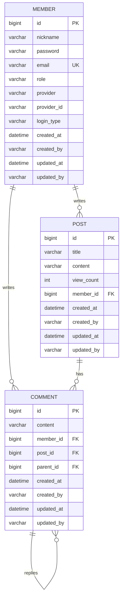

# Board ERD 문서

## 1. ERD 개요

현재 Board 프로젝트의 JPA Entity는 다음 3개이다.

- `Member`: 회원, 로그인 유형, 권한, OAuth2 provider 정보를 관리한다.
- `Post`: 게시글 제목, 내용, 조회수, 작성자를 관리한다.
- `Comment`: 게시글 댓글과 대댓글을 관리한다.

주요 관계:

- 회원 1명은 여러 게시글을 작성할 수 있다.
- 회원 1명은 여러 댓글을 작성할 수 있다. 단, `Member` Entity에는 댓글 컬렉션이 없다.
- 게시글 1개는 여러 댓글을 가질 수 있다.
- 댓글은 `parent_id`를 통해 자기 참조 대댓글 구조를 가진다.

OAuth2 로그인 관련 필드:

- `member.provider`: provider 이름. 예: google, naver, kakao
- `member.provider_id`: provider가 내려준 사용자 고유 ID
- `member.login_type`: `LOCAL` 또는 `SOCIAL`

관리자 권한 관련 필드:

- `member.role`: `USER`, `ADMIN`
- Spring Security에서는 `Role.getKey()`를 통해 `ROLE_USER`, `ROLE_ADMIN` 권한 문자열을 사용한다.

Audit 필드:

`BaseEntity`가 `@MappedSuperclass`로 다음 필드를 제공한다.

- `created_at`
- `created_by`
- `updated_at`
- `updated_by`

`created_by`, `updated_by`는 `nullable = false`이고, `JpaConfig`의 `AuditorAware`가 현재 인증 사용자의 nickname 또는 `system`을 제공한다.

## 2. 현재 구현 테이블 목록

### member

Entity: `src/main/java/project/board/member/entity/Member.java`

| 컬럼명 | 타입 | NULL 허용 | 키 | 설명 |
|---|---|---:|---|---|
| id | BIGINT | N | PK | 회원 ID |
| nickname | VARCHAR(100) | N |  | 닉네임 |
| password | VARCHAR | N |  | 암호화된 비밀번호. OAuth2 회원도 dummy password 저장 |
| email | VARCHAR | N | UNIQUE | 이메일 |
| role | VARCHAR | N |  | `USER`, `ADMIN` |
| provider | VARCHAR | Y |  | OAuth2 provider |
| provider_id | VARCHAR | Y |  | OAuth2 provider 사용자 ID |
| login_type | VARCHAR | Y |  | `LOCAL`, `SOCIAL` |
| created_at | DATETIME | Y |  | 생성일 |
| created_by | VARCHAR | N |  | 생성자 |
| updated_at | DATETIME | Y |  | 수정일 |
| updated_by | VARCHAR | N |  | 수정자 |

비고:

- `email`은 Entity에 `unique = true`가 명시되어 있다.
- `login_type`은 `@Enumerated(EnumType.STRING)`이지만 `nullable = false`는 명시되어 있지 않다.
- `nickname` 중복은 Repository 조회로 검사하지만 Entity 컬럼에 unique 제약은 명시되어 있지 않다.

### post

Entity: `src/main/java/project/board/post/entity/Post.java`

| 컬럼명 | 타입 | NULL 허용 | 키 | 설명 |
|---|---|---:|---|---|
| id | BIGINT | N | PK | 게시글 ID |
| title | VARCHAR(500) | N |  | 제목 |
| content | VARCHAR(500) | N |  | 내용 |
| view_count | INT | N |  | 조회수. Java primitive int |
| member_id | BIGINT | N | FK | 작성자 회원 ID |
| created_at | DATETIME | Y |  | 생성일 |
| created_by | VARCHAR | N |  | 생성자 |
| updated_at | DATETIME | Y |  | 수정일 |
| updated_by | VARCHAR | N |  | 수정자 |

비고:

- `member_id`는 `@ManyToOne(fetch = FetchType.LAZY)`와 `@JoinColumn(nullable = false)`이다.
- `view_count`는 Java primitive `int`라 null을 가질 수 없다.

### comment

Entity: `src/main/java/project/board/comment/entity/Comment.java`

| 컬럼명 | 타입 | NULL 허용 | 키 | 설명 |
|---|---|---:|---|---|
| id | BIGINT | N | PK | 댓글 ID |
| content | VARCHAR(500) | N |  | 댓글 내용 |
| member_id | BIGINT | N | FK | 댓글 작성자 ID |
| post_id | BIGINT | N | FK | 게시글 ID |
| parent_id | BIGINT | Y | FK | 부모 댓글 ID. null이면 root comment |
| created_at | DATETIME | Y |  | 생성일 |
| created_by | VARCHAR | N |  | 생성자 |
| updated_at | DATETIME | Y |  | 수정일 |
| updated_by | VARCHAR | N |  | 수정자 |

비고:

- `member_id`, `post_id`는 `nullable = false`이다.
- `parent_id`는 nullable이며 대댓글을 표현한다.
- `children`에는 cascade 또는 orphanRemoval이 설정되어 있지 않다.

## 3. 관계 설명

### Member : Post

- 관계 유형: 1:N
- FK 위치: `post.member_id`
- 연관관계 주인: `Post.member`
- 반대편 컬렉션: `Member.posts`
- Cascade 사용 여부: 없음
- orphanRemoval 사용 여부: 없음
- fetch 전략:
  - `Post.member`: LAZY
  - `Member.posts`: 기본 LAZY
- 삭제 시 주의사항:
  - cascade가 없으므로 회원 삭제 전에 게시글을 직접 삭제해야 한다.
  - 현재 `MemberService.MemberRemovalPolicy`가 회원 게시글을 bulk delete한다.

### Member : Comment

- 관계 유형: 1:N
- FK 위치: `comment.member_id`
- 연관관계 주인: `Comment.member`
- 반대편 컬렉션: 현재 `Member`에는 `comments` 컬렉션 없음
- Cascade 사용 여부: 없음
- orphanRemoval 사용 여부: 없음
- fetch 전략:
  - `Comment.member`: LAZY
- 삭제 시 주의사항:
  - 회원 삭제 전에 해당 회원이 작성한 댓글을 직접 삭제해야 한다.
  - 현재 `CommentRepository.deleteAllByMemberId`를 사용한다.

### Post : Comment

- 관계 유형: 1:N
- FK 위치: `comment.post_id`
- 연관관계 주인: `Comment.post`
- 반대편 컬렉션: `Post.comments`
- Cascade 사용 여부: 없음
- orphanRemoval 사용 여부: 없음
- fetch 전략:
  - `Comment.post`: LAZY
  - `Post.comments`: 기본 LAZY
- 삭제 시 주의사항:
  - 게시글 삭제 전에 댓글을 직접 삭제해야 한다.
  - 현재 `CommentRepository.deleteByPostId`를 사용한다.

### Comment : Comment

- 관계 유형: self 1:N
- FK 위치: `comment.parent_id`
- 연관관계 주인: `Comment.parent`
- 반대편 컬렉션: `Comment.children`
- Cascade 사용 여부: 없음
- orphanRemoval 사용 여부: 없음
- fetch 전략:
  - `Comment.parent`: LAZY
  - `Comment.children`: 기본 LAZY
- 삭제 시 주의사항:
  - 부모 댓글 삭제 시 자식 댓글 처리 정책이 명시되어 있지 않다.
  - FK 제약이 있는 DB에서는 자식 댓글이 남아 있으면 부모 댓글 삭제가 실패할 수 있다.

## 4. Mermaid ERD



## 5. dbdiagram.io DBML

dbdiagram.io용 DBML은 별도 파일에 작성되어 있다.

- `docs/erd/board.dbml`

현재 Entity 기준 DBML:

```dbml
Enum role {
  ADMIN
  USER
}

Enum login_type {
  LOCAL
  SOCIAL
}

Table member {
  id bigint [pk, increment]
  nickname varchar(100) [not null]
  password varchar [not null]
  email varchar [not null, unique]
  role role [not null]
  provider varchar
  provider_id varchar
  login_type login_type
  created_at datetime
  created_by varchar [not null]
  updated_at datetime
  updated_by varchar [not null]
}

Table post {
  id bigint [pk, increment]
  title varchar(500) [not null]
  content varchar(500) [not null]
  view_count int [not null, default: 0]
  member_id bigint [not null]
  created_at datetime
  created_by varchar [not null]
  updated_at datetime
  updated_by varchar [not null]
}

Table comment {
  id bigint [pk, increment]
  content varchar(500) [not null]
  member_id bigint [not null]
  post_id bigint [not null]
  parent_id bigint
  created_at datetime
  created_by varchar [not null]
  updated_at datetime
  updated_by varchar [not null]
}

Ref: post.member_id > member.id
Ref: comment.member_id > member.id
Ref: comment.post_id > post.id
Ref: comment.parent_id > comment.id
```

## 6. ERD 설계 리뷰

### 현재 설계의 장점

- 핵심 도메인이 `Member`, `Post`, `Comment`로 단순하고 이해하기 쉽다.
- 게시글과 댓글 모두 작성자 FK를 명확히 가진다.
- 댓글 self reference로 대댓글 구조를 확장할 수 있다.
- OAuth2와 local login을 하나의 Member 테이블에서 처리한다.
- Audit 필드가 공통 BaseEntity에 분리되어 있다.

### FK 구조의 적절성

- `post.member_id`, `comment.member_id`, `comment.post_id`는 필수 관계로 적절하다.
- `comment.parent_id`는 nullable self FK로 root comment와 reply를 구분하기에 적절하다.
- 단, `Member`에는 댓글 컬렉션이 없어 양방향 탐색은 게시글에만 존재한다.

### 회원 삭제 시 문제 가능성

- cascade가 없기 때문에 회원 삭제 전에 댓글/게시글을 직접 삭제해야 한다.
- 현재는 bulk delete 순서로 직접 삭제한다.
- bulk delete는 영속성 컨텍스트와 Entity lifecycle callback을 우회하므로 추후 audit/logging 정책과 충돌할 수 있다.
- 관리자 자기 자신 삭제, 마지막 관리자 삭제 같은 운영 정책이 필요할 수 있다.

### 게시글/댓글 삭제 정책 개선점

- 현재 게시글 삭제는 댓글을 먼저 삭제한 뒤 게시글을 삭제한다.
- 댓글 삭제는 단일 댓글 삭제이며 대댓글이 있는 부모 댓글 삭제 정책이 명확하지 않다.
- 선택지:
  - 대댓글이 있으면 부모 댓글 삭제 금지
  - 부모 댓글을 "삭제된 댓글입니다"로 soft delete
  - 자식 댓글까지 cascade delete

### Soft Delete 도입 여부

- 현재 구현은 hard delete이다.
- 포트폴리오/운영 관점에서는 soft delete가 유리하다.
- 게시글/댓글 신고, 관리자 복구, 감사 로그가 필요하면 `deleted_at`, `deleted_by`, `deleted` 같은 컬럼을 추가할 수 있다.

### 조회수 동시성 문제

- 현재 조회수 증가는 DB update query로 수행되어 엔티티 read-modify-write보다 안전하다.
- 중복 조회 방지는 쿠키 기반이며 사용자/브라우저 변경에는 취약하다.
- 대량 트래픽에서는 매 상세 조회마다 DB update가 발생할 수 있다.

### 카테고리/게시판 기능 추가 시 ERD 확장 방향

- `board` 또는 `category` 테이블을 추가하고 `post.board_id` 또는 `post.category_id`를 둔다.
- 게시판별 권한, 공지 여부, 노출 순서 등을 추가할 수 있다.

### 좋아요 기능 추가 시 ERD 확장 방향

- `post_like`, `comment_like` 테이블을 추가한다.
- `(member_id, post_id)`, `(member_id, comment_id)` unique 제약이 필요하다.
- 좋아요 수를 실시간 집계할지, denormalized count로 관리할지 결정해야 한다.

### 파일 첨부 기능 추가 시 ERD 확장 방향

- `attachment` 테이블을 추가하고 `post_id` FK를 둔다.
- 원본 파일명, 저장 파일명, 경로, 크기, 확장자, MIME type을 관리한다.
- 저장소는 local 또는 AWS S3를 선택할 수 있다.

### 알림 기능 추가 시 ERD 확장 방향

- `notification` 테이블을 추가하고 수신자 `member_id` FK를 둔다.
- 알림 유형, 대상 ID, 읽음 여부, 생성일을 관리한다.
- 실시간 전송은 SSE 또는 WebSocket으로 확장할 수 있다.

## 7. 확장 ERD 설계 예시

이 섹션은 현재 구현이 아니다. 앞으로 추가할 만한 기능을 위한 확장 설계 예시이다.

### 게시판/카테고리 기능

예상 테이블:

- `board`
- `category`

관계:

- Board 1:N Post
- Board 1:N Category
- Category 1:N Post

설명:

- 자유게시판, 공지사항, 질문게시판 등을 분리할 수 있다.
- 관리자가 게시판을 생성/수정/삭제할 수 있다.
- 게시글 작성 시 게시판 또는 카테고리를 선택할 수 있다.

예상 컬럼:

| 테이블 | 주요 컬럼 |
|---|---|
| board | id, name, description, sort_order, active |
| category | id, board_id, name, sort_order, active |
| post | board_id, category_id |

### 좋아요 기능

예상 테이블:

- `post_like`
- `comment_like`

관계:

- Member 1:N PostLike
- Post 1:N PostLike
- Member 1:N CommentLike
- Comment 1:N CommentLike

설명:

- 회원당 게시글 또는 댓글에 1회만 좋아요 가능하도록 unique 제약조건이 필요하다.
- 좋아요 취소 기능을 고려해야 한다.
- 동시성 처리가 필요할 수 있다.

예상 unique 제약:

- `post_like(member_id, post_id)`
- `comment_like(member_id, comment_id)`

### 파일 첨부 기능

예상 테이블:

- `attachment`

관계:

- Post 1:N Attachment

설명:

- 게시글 이미지 또는 파일 첨부 기능을 확장할 수 있다.
- 파일 저장소는 로컬 또는 AWS S3를 고려할 수 있다.
- 원본 파일명, 저장 파일명, 경로, 크기, 확장자, MIME 타입 등을 관리한다.

예상 컬럼:

- id
- post_id
- original_filename
- stored_filename
- storage_path
- file_size
- extension
- mime_type
- created_at

### 알림 기능

예상 테이블:

- `notification`

관계:

- Member 1:N Notification

설명:

- 내 게시글에 댓글이 달렸을 때 알림을 생성할 수 있다.
- 내 댓글에 답글이 달렸을 때 알림을 생성할 수 있다.
- 알림 읽음 여부를 관리할 수 있다.

예상 컬럼:

- id
- receiver_id
- type
- target_type
- target_id
- message
- read
- created_at

### 신고 기능

예상 테이블:

- `report`

관계:

- Member 1:N Report
- Post 또는 Comment 대상 신고

설명:

- 부적절한 게시글 또는 댓글을 신고할 수 있다.
- 관리자가 신고 목록을 확인하고 조치할 수 있다.
- 대상 타입과 대상 ID를 두는 방식 또는 post_report/comment_report로 분리하는 방식이 있다.

예상 컬럼:

- id
- reporter_id
- target_type
- target_id
- reason
- status
- processed_by
- processed_at

### 조회수 개선

예상 구조:

- Redis Set
- Redis Counter
- DB 반영용 스케줄러

설명:

- 동일 사용자 또는 동일 IP의 중복 조회를 방지한다.
- DB에 매 요청마다 update하지 않고 Redis에 임시 저장 후 주기적으로 반영한다.
- 인기 게시글 기능으로 확장할 수 있다.
